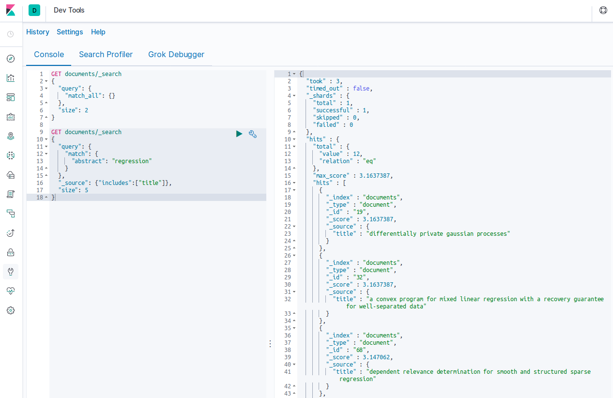

# elasticsearching

### setup elastic search
    docker-compose up -d
    
### minimal example to populate es-index
apdapt `host` in `populating_es_index.py` and run  [populating_es_minimal_example.py](populating_es_minimal_example.py)

### in some browser
1. goto

        http://<some_host>:5601/app/kibana#/dev_tools/console 

2. have fun with kibana console (formerly know as Sense)
    
    
    
### [aminer](https://www.aminer.org/oag2019) -data
  1. download data with [download_aiminer_data.py](download_aiminer_data.py)
  2. run [aminer_to_es_streaming_bulk.py](aminer_to_es_streaming_bulk.py)
  
### semantic scholar
    
    wget https://s3-us-west-2.amazonaws.com/ai2-s2-research-public/open-corpus/2019-10-01/manifest.txt
    wget -B https://s3-us-west-2.amazonaws.com/ai2-s2-research-public/open-corpus/2019-10-01/ -i manifest.txt

  
  
### benchmarking indexing speed
    populating es-index of 1000000 documents took: 157.97 seconds
    streaming-speed: 6330.21 docs per second
    
    populating es-index of 1000000 documents took: 104.89 seconds
    1 processes parallel-bulk-speed: 9534.04 docs per second
    
    populating es-index of 1000000 documents took: 155.87 seconds
    1 processes parallel-pool-speed: 6415.42 docs per second
    
    populating es-index of 1000000 documents took: 94.28 seconds
    2 processes parallel-bulk-speed: 10606.79 docs per second
    
    populating es-index of 1000000 documents took: 96.38 seconds
    2 processes parallel-pool-speed: 10375.75 docs per second
    
    populating es-index of 1000000 documents took: 90.27 seconds
    4 processes parallel-bulk-speed: 11078.32 docs per second
    
    populating es-index of 1000000 documents took: 54.93 seconds
    4 processes parallel-pool-speed: 18206.30 docs per second
    
    populating es-index of 1000000 documents took: 89.52 seconds
    8 processes parallel-bulk-speed: 11171.00 docs per second
    
    populating es-index of 1000000 documents took: 36.03 seconds
    8 processes parallel-pool-speed: 27756.82 docs per second
