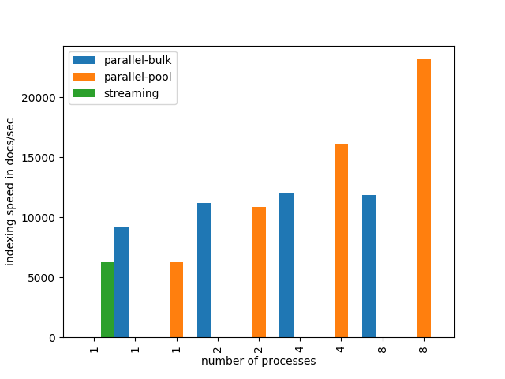
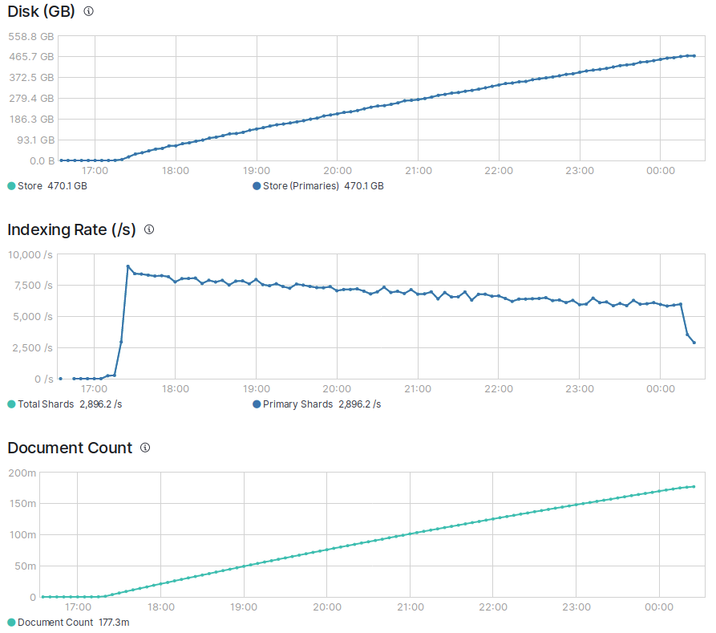

# elasticsearching

### setup elastic search
    docker-compose up -d
    
### minimal example to populate es-index
adapt `host` in `populating_es_index.py` and run  [populating_es_minimal_example.py](populating_es_minimal_example.py)

### in some browser
1. goto

        http://<some_host>:5601/app/kibana#/dev_tools/console 

2. have fun with kibana console (formerly know as Sense)
    
    

#### get semantic scholar data
    
    wget https://s3-us-west-2.amazonaws.com/ai2-s2-research-public/open-corpus/2019-10-01/manifest.txt
    wget -B https://s3-us-west-2.amazonaws.com/ai2-s2-research-public/open-corpus/2019-10-01/ -i manifest.txt

### [benchmarking indexing speed](benchmark_speed.py)
indexing rate for __2 mio. documents__
 

* indexing __177 million documents__ took little more than __7 hours__ with a rate of aprox. __7500 docs/sec__

